# 🍔 FoodyMind Admin App

<p align="center">
  
</p>

<p align="center">


</p>

---

# 📱 About The Project

**FoodyMind Admin App** is an Android-based **Restaurant Management Application** developed using **Kotlin** and **MVVM Architecture**.

The application enables restaurant administrators to efficiently manage food items, customer orders, delivery status, restaurant operations, and user management through a clean and scalable interface.

All application data is handled using **Firebase Authentication**, **Firebase Realtime Database**, and **Firebase Storage**, providing real-time synchronization and secure cloud storage.

The project is designed with modern Android development practices and follows a structured architecture, making it suitable for **academic projects**, **professional portfolios**, and **real-world learning**.

---

# ✨ Features

## 👨‍💼 Admin Authentication

* Secure Admin Login
* Admin Registration
* Firebase Authentication
* Session Management
* Logout Functionality

---

## 📊 Dashboard

* Total Earnings
* Pending Orders Count
* Completed Orders Count
* Restaurant Overview
* Quick Navigation

---

## 🍽 Food Management

* Add New Food Item
* Upload Food Image
* Set Food Name
* Set Food Price
* Set Food Description
* Set Food Ingredient
* Store Data in Firebase

---

## 📋 All Items Management

* View All Food Items
* Update Food Details
* Delete Food Item
* Dynamic RecyclerView
* Real-Time Data Synchronization

---

## 📦 Order Management

* View Pending Orders
* Accept Orders
* Dispatch Orders
* Track Order Status
* Update Delivery Status

---

## 🚚 Delivery Management

* Out For Delivery Orders
* Completed Orders
* Order Status Updates
* Customer Order Tracking
* Real-Time Database Updates

---

## 👥 User Management

* Create New User
* Store User Information
* Manage Customer Data
* Firebase Integration
* Authentication Support

---

## 👤 Admin Profile

* View Profile
* Update Profile Information
* Manage Account Details
* Logout Securely

---

# ⭐ Why This Project?

* ✅ Built using MVVM Architecture
* ✅ Firebase Backend Integration
* ✅ Modern Android Development
* ✅ Real-Time Order Management
* ✅ Clean and Scalable Code Structure
* ✅ Professional Portfolio Project
* ✅ Industry-Level Architecture
* ✅ Easy to Maintain and Extend

---

# 🎯 Main Modules

* 🔐 Authentication Module
* 📊 Dashboard Module
* 🍽 Food Management Module
* 📋 All Items Module
* 📦 Pending Orders Module
* 🚚 Out For Delivery Module
* ✅ Completed Orders Module
* 👥 User Management Module
* 👤 Profile Module

---

# 🚀 Highlights

* Real-Time Firebase Database
* Cloud Image Storage
* MVVM Architecture
* Repository Pattern
* RecyclerView Integration
* ViewBinding
* Glide Image Loading
* Kotlin Based Development
* Modern Android UI
* Clean Project Structure

---
# 🏗 Architecture

The project follows **MVVM (Model-View-ViewModel)** Architecture to ensure clean code, better maintainability, scalability, and separation of concerns.

```
                View
        (Activity / Fragment)
                    │
                    │
                    ▼
              ViewModel
                    │
                    │
                    ▼
               Repository
                    │
                    │
                    ▼
      Firebase Realtime Database
                    │
                    │
        ┌───────────┴───────────┐
        │                       │
        ▼                       ▼
Firebase Authentication   Firebase Storage
```

---

# 🔥 Firebase Services Used

## ✅ Firebase Authentication

Used for secure admin authentication.

* Admin Login
* Admin Registration
* Session Management
* User Authentication
* Secure Access Control

---

## ✅ Firebase Realtime Database

Used for storing and updating application data in real time.

* Food Items
* Customer Orders
* Pending Orders
* Completed Orders
* User Information
* Earnings Data
* Restaurant Data

---

## ✅ Firebase Storage

Used for storing application images.

* Food Images
* Item Photos
* Image Management
* Cloud Storage
* Fast Retrieval

---

# 🛠 Tech Stack

| Technology      | Used                       |
| --------------- | -------------------------- |
| Language        | Kotlin                     |
| Architecture    | MVVM                       |
| IDE             | Android Studio             |
| Database        | Firebase Realtime Database |
| Authentication  | Firebase Authentication    |
| Storage         | Firebase Storage           |
| UI              | XML                        |
| Image Loading   | Glide                      |
| Version Control | Git                        |
| Repository      | GitHub                     |

---

# 📂 Project Structure

```
com.example.foodymindadmin

│

├── Adapter

├── Fragment

├── Model

├── Repository

├── ViewModel

│

├── LoginActivity

├── SignUpActivity

├── MainActivity

├── AddItemActivity

├── AllItemActivity

├── PendingOrderActivity

├── OutForDeliveryActivity

├── CreateUserActivity

├── ProfileActivity

│

└── Firebase Services
```

---

# 📦 Libraries & Dependencies

```gradle
implementation "com.google.firebase:firebase-auth"

implementation "com.google.firebase:firebase-database"

implementation "com.google.firebase:firebase-storage"

implementation "com.github.bumptech.glide:glide"

implementation "androidx.recyclerview:recyclerview"

implementation "androidx.lifecycle:lifecycle-viewmodel-ktx"

implementation "androidx.lifecycle:lifecycle-livedata-ktx"

implementation "androidx.navigation:navigation-fragment-ktx"

implementation "androidx.navigation:navigation-ui-ktx"

implementation "androidx.cardview:cardview"

implementation "com.google.android.material:material"
```

---

# ⭐ Special Functionalities

* ✅ MVVM Architecture
* ✅ Firebase Integration
* ✅ Admin Authentication
* ✅ Dynamic Food Item Management
* ✅ Real-Time Order Management
* ✅ Pending Orders Tracking
* ✅ Out For Delivery Management
* ✅ Completed Orders Tracking
* ✅ Create New User Functionality
* ✅ Profile Management
* ✅ Firebase Storage Images
* ✅ RecyclerView Integration
* ✅ ViewBinding Support
* ✅ Clean & Scalable Project Structure
* ✅ Modern Android UI Design
* ✅ Cloud-Based Data Synchronization
* ✅ Fast and Efficient Performance

---

# 🎯 Core Modules

## 🍽 Food Module

* Add Food Items
* Update Food Items
* Delete Food Items
* View All Items

---

## 📦 Order Module

* Pending Orders
* Accept Orders
* Out For Delivery
* Completed Orders

---

## 👥 User Module

* Create New User
* Manage User Information
* Firebase Authentication

---

## 📊 Dashboard Module

* Earnings
* Order Statistics
* Quick Access Features

---

## 🔒 Security Module

* Firebase Authentication
* Secure Database Access
* Cloud Storage Integration

---
# 📸 Application Screenshots

## 🚀 Splash Screen

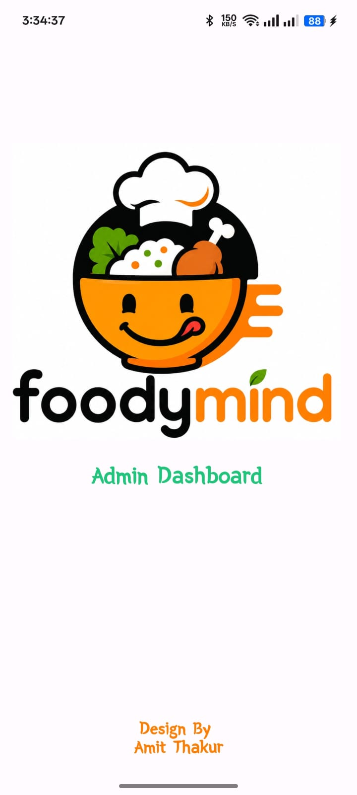

---

## 🔐 Admin Login Screen

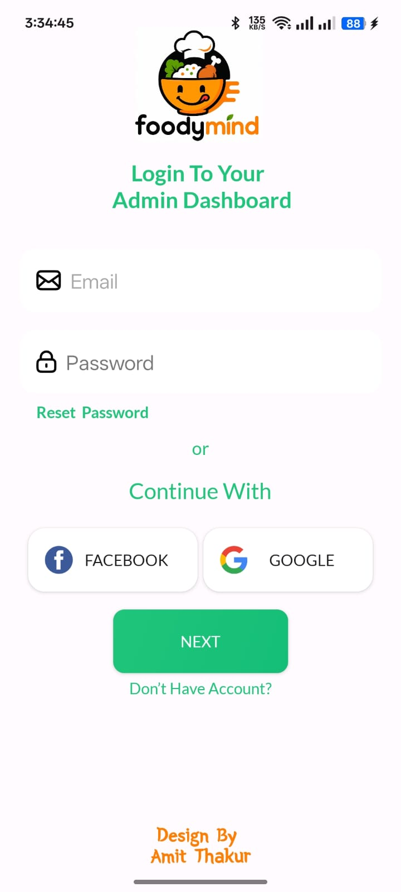

---

## 🏠 Dashboard

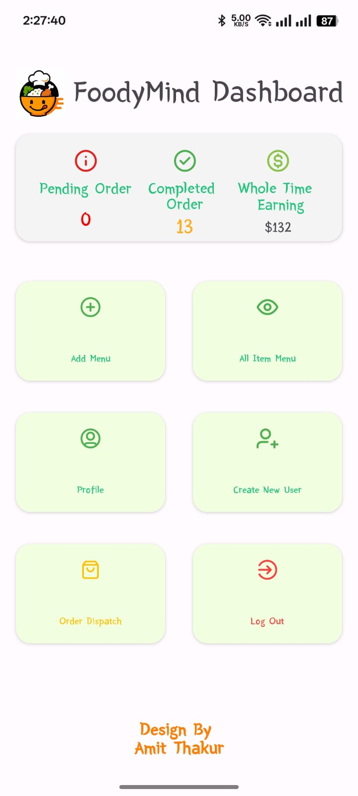

---

## 🍽 Add Food Item

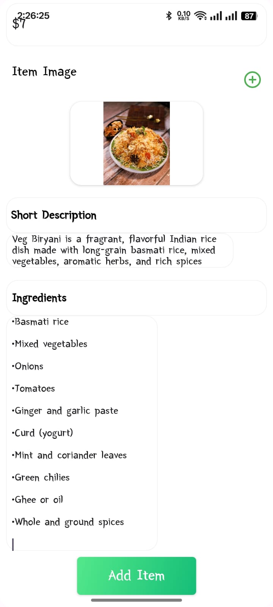

---

## 📋 All Food Items

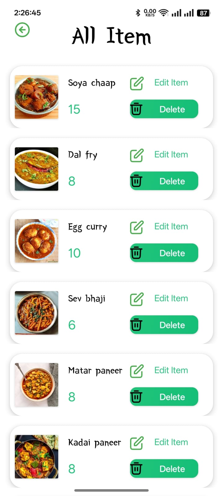

---

## 📦 Pending Orders

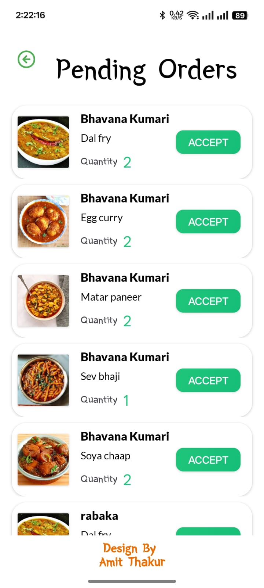

---

## 🚚 Out For Delivery

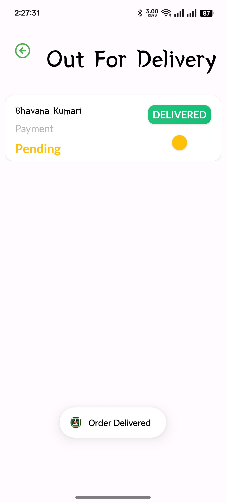

---

## ✅ Completed Orders

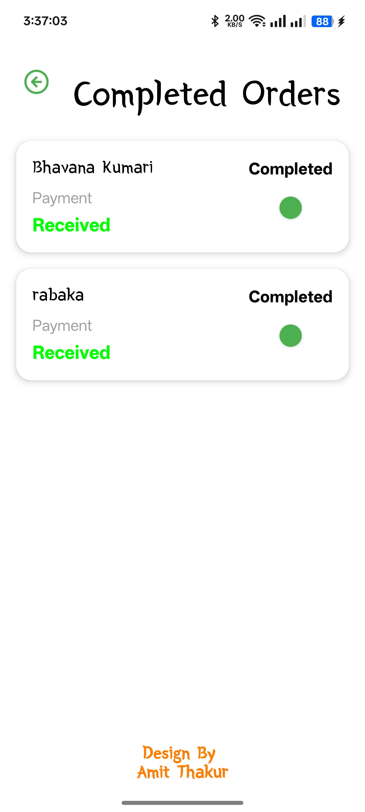

---

## 👥 Create New User

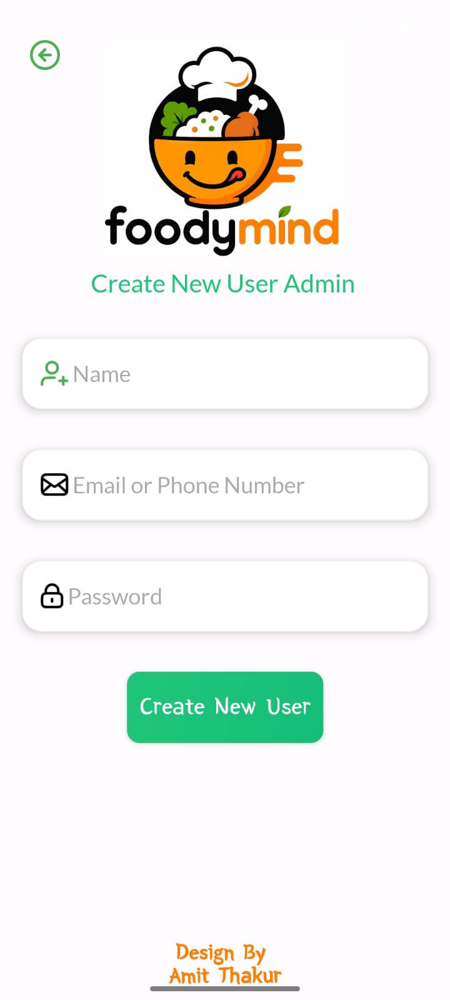

---

## 👤 Admin Profile

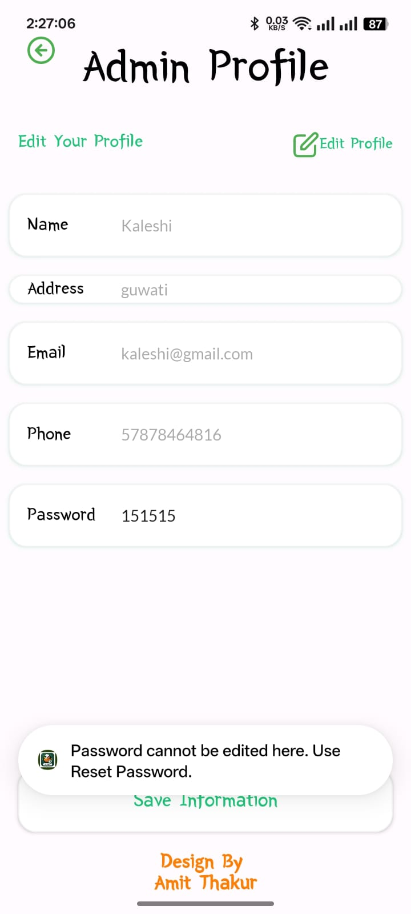

---

## 🏗 MVVM Architecture

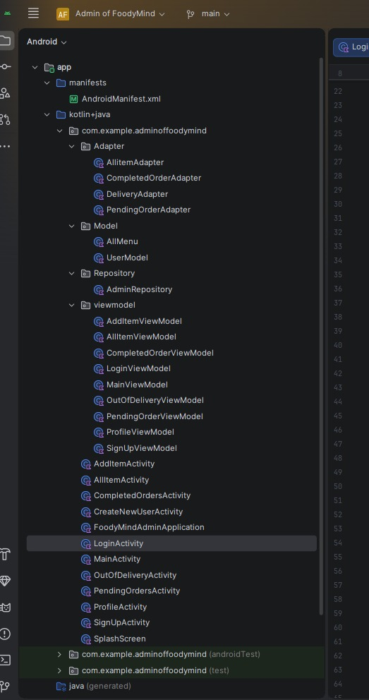
---

# 🚀 Getting Started

## Clone Repository

```bash
git clone https://github.com/amittthakur2156/FoodyMind-Admin-App.git
```

---

## Open Project

* Open Android Studio
* Click **Open**
* Select the project folder
* Sync Gradle
* Wait for indexing to complete

---

# 🔥 Firebase Setup

## Step 1

Create a Firebase Project.

---

## Step 2

Enable:

* Firebase Authentication
* Firebase Realtime Database
* Firebase Storage

---

## Step 3

Download:

```
google-services.json
```

---

## Step 4

Place it inside:

```
app/
    google-services.json
```

---

## Step 5

Sync Gradle and build the project.

---

# ▶️ Run the Project

* Connect an Android Device or Emulator
* Click **Run ▶**
* Login as Admin
* Manage Food Items and Orders

---

# 💻 Requirements

* Android Studio
* JDK 17+
* Kotlin
* Firebase Project
* Internet Connection

---

# 📱 Supported Features

* Food Management
* Order Management
* Delivery Management
* User Management
* Firebase Integration
* Real-Time Updates

---
---

# 📂 Repository

## GitHub Repository

```text
https://github.com/amittthakur2156/FoodyMind-Admin-App
```

---

# 👨‍💻 Developer

## Amit Thakur

Android Developer

### Skills

* Kotlin
* MVVM Architecture
* Firebase
* Android Studio
* XML UI
* Git & GitHub

---

# 🎯 Project Objectives

This project was developed to learn and implement:

* Modern Android Development
* MVVM Architecture
* Firebase Authentication
* Firebase Realtime Database
* Firebase Storage
* Repository Pattern
* Clean Code Practices
* Real-Time Order Management

---

# 🌟 Future Improvements

* ❤️ Online Payment Management
* ❤️ Sales Analytics Dashboard
* ❤️ Push Notifications
* ❤️ Restaurant Reports
* ❤️ Dark Mode
* ❤️ Role-Based Admin Access
* ❤️ Order Search & Filters
* ❤️ Customer Feedback System
* ❤️ AI-Based Sales Prediction
* ❤️ Export Reports (PDF/Excel)

---

# 🏆 Project Highlights

* ✅ Kotlin Based Development
* ✅ MVVM Architecture
* ✅ Firebase Integration
* ✅ Admin Authentication
* ✅ Dynamic Food Management
* ✅ Pending Orders Management
* ✅ Out For Delivery Management
* ✅ Completed Orders Management
* ✅ Create New User Module
* ✅ Real-Time Database Updates
* ✅ Firebase Storage Integration
* ✅ RecyclerView Implementation
* ✅ ViewBinding Support
* ✅ Clean & Scalable Project Structure
* ✅ Portfolio Ready Project

---

# ⭐ Support

If you like this project,

⭐ Star this repository

🍴 Fork this repository

🛠 Contribute to this project

📢 Share it with your friends

---

# 📜 License

This project is developed for **learning, academic, and portfolio purposes**.

You are welcome to use it for educational purposes while giving appropriate credit to the original author.

---

# 🙏 Acknowledgements

Special thanks to:

* Kotlin Team
* Android Developers Community
* Firebase Team
* Open Source Community

for providing amazing tools and resources.

---

# ❤️ Thank You

Thank you for visiting this repository.

If you found this project useful, please consider giving it a ⭐ on GitHub.

---

<p align="center">

# 🍔 FoodyMind Admin App

## Manage Smart • Serve Fast • Grow Better 🚀

### Built with ❤️ using Kotlin, Firebase & MVVM Architecture

</p>
